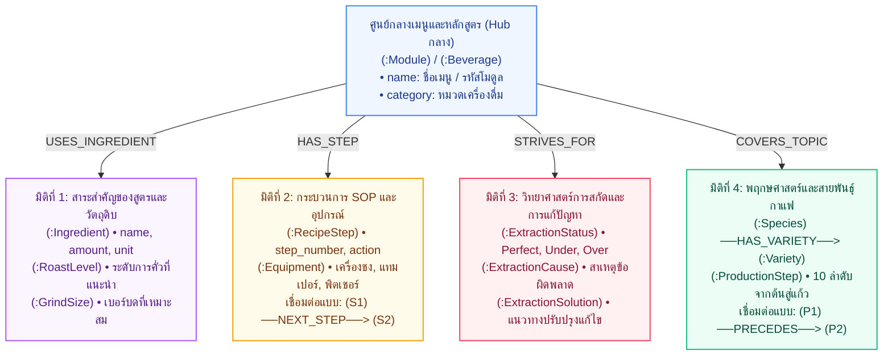

# Neo4j Knowledge Graph Schema – คู่มือบาริสต้ามืออาชีพ
> ข้อมูลจากเอกสาร: **คู่มือประกอบการฝึกอบรม หลักสูตร: บาริสต้ามืออาชีพ** (`documents.pdf`)  
> พัฒนาสำหรับระบบ **SmartDoc Assistant – Hybrid GraphRAG LINE Chatbot**

---

## 🏛️ 1. Ontology Diagram (แผนภาพโครงสร้างภววิทยา 4 มิติ)

> **คำจำกัดความ (Terminology Clarity):**
> * **Ontology Diagram (แผนภาพนี้):** คือโครงสร้างมโนทัศน์ (Conceptual Schema / Data Model) แสดงประเภทของ Entity (Classes) และความสัมพันธ์ทางความหมาย (Semantic Relations) ของศาสตร์บาริสต้า ออกแบบตามสไตล์สไลด์นำเสนอ 4 มิติ
> * **Knowledge Graph (ภาพใน Neo4j Browser):** คือเครือข่ายข้อมูลจริง (Instances) ที่บรรจุข้อมูลครบทั้ง 53 หน้า รวม 359 โหนด และ 773 เส้นความสัมพันธ์
> * **System Architecture Diagram:** คือแผนภาพสถาปัตยกรรมระบบทางเทคนิค (Pipeline จาก Ingestion $\rightarrow$ Neo4j/FAISS $\rightarrow$ Hybrid RAG $\rightarrow$ LINE Webhook)

โครงสร้าง Ontology ขององค์ความรู้บาริสต้า ออกแบบโดยมี **ศูนย์กลางหลักสูตร / เมนูเครื่องดื่ม** และแตกแขนงออกเป็น **4 มิติหลัก (4 Dimensions)**:



---

## 📊 2. ภาพรวม Knowledge Graph ในระบบ

* **ขอบเขตเนื้อหา:** คู่มือประกอบการฝึกอบรม หลักสูตร: บาริสต้ามืออาชีพ (5 โมดูล, 53 หน้า)
* **สถิติในฐานข้อมูล:** **359 โหนด (Nodes)** และ **773 เส้นความสัมพันธ์ (Relationships)**
* **กระบวนการสร้างกราฟ (Data Ingestion Pipeline):**
  * `PDF` $\rightarrow$ `SBERT (paraphrase-multilingual-MiniLM-L12-v2)` + `Ollama LLM (qwen2.5:7b)` $\rightarrow$ `Domain Ontology` $\rightarrow$ `Neo4j`
  * **โหมดปกติ (Fast Mode):** `python feed_graph.py` (ใช้ SBERT Matrix ประมวลผลเร็วใน 3-5 วินาที)
  * **โหมด LLM สมบูรณ์ (LLM-Enriched Mode):** `python feed_graph.py --llm` (เรียกใช้ `qwen2.5:7b` สรุปเนื้อหาทั้ง 53 หน้าลงใน `page_knowledge.json`)

### สรุป 5 หมวดหมู่ในเอกสาร PDF (Modules):
1. **หมวดที่ 1: ความรู้เบื้องต้นเกี่ยวกับเมล็ดกาแฟ (หน้า 3-19)**
   * พฤกษศาสตร์, สายพันธุ์ (Arabica, Robusta, Peaberry), 10 ขั้นตอนจากต้นสู่แก้ว, ระดับการคั่ว (Agtron), ระดับการบด
2. **หมวดที่ 2: เคล็ดลับการชงกาแฟ หลักการและวิธีการ (หน้า 20-31)**
   * วิทยาศาสตร์การสกัด (Extraction), การวินิจฉัยปัญหา Perfect vs Under vs Over Extraction, สาเหตุและวิธีแก้ไข
3. **หมวดที่ 3: ประวัติความเป็นมาและศาสตร์ของลาเต้อาร์ต (หน้า 32-36)**
   * ประวัติศาสตร์, วิทยาศาสตร์การสตีมนม (Microfoam), อุณหภูมิที่เหมาะสม (60–65°C), เทคนิค Free Pour และ Etching
4. **หมวดที่ 4: ใบขั้นตอนการปฏิบัติงาน SOP การชงเครื่องดื่ม (หน้า 37-50)**
   * สูตรมาตรฐาน 13 เมนูยอดนิยม (กาแฟร้อน-เย็น), สัดส่วนวัตถุดิบ, อุปกรณ์ และขั้นตอนการทำอย่างละเอียด
5. **หมวดที่ 5: ใบงาน ใบทดสอบ และใบเฉลย (หน้า 51-53)**
   * แบบทดสอบความรู้บาริสต้า เกณฑ์การประเมิน และแนวทางปฏิบัติ

---

## 🎨 3. คำสั่ง Cypher สำหรับแสดงกราฟ (Visualization Queries)
> 💡 *นำคำสั่งด้านล่างไปวางใน Neo4j Browser แล้วกด Run จะได้ผลลัพธ์เป็นลูกกลมกราฟสีสวยงาม นำไปแคปภาพใส่สไลด์ได้ทันที*

### 1) กราฟภาพรวมทั้งระบบ (Overview Cluster)
*แสดงคลัสเตอร์ความสัมพันธ์หลักในฐานข้อมูลทั้งหมด (จำกัด 100 เส้น เพื่อความสวยงาม ไม่แน่นเกินไป)*
```cypher
MATCH (n)-[r]->(m)
RETURN n, r, m
LIMIT 100;
```

---

### 2) กราฟสูตรเครื่องดื่ม SOP (Beverage Recipe Subgraph)
*แสดงเมนูกาแฟ พร้อมแตกกิ่งไปยัง วัตถุดิบ, อุปกรณ์, และขั้นตอนการชง 1, 2, 3...*
```cypher
MATCH (b:Beverage)-[r]->(target)
WHERE b.name CONTAINS 'ส้ม' OR b.name CONTAINS 'ลาเต้'
RETURN b, r, target;
```
*(หากต้องการดูทุกเมนูพร้อมกัน ให้ลบบรรทัด `WHERE ...` ออก)*

---

### 3) กราฟสายพันธุ์กาแฟและการแปรรูป (Coffee Species & Varieties)
*แสดงสายพันธุ์กาแฟ อาราบิก้า / โรบัสต้า / พีเบอร์รี่ แตกกิ่งไปยังสายพันธุ์ย่อย*
```cypher
MATCH (s:Species)-[r:HAS_VARIETY]->(v:Variety)
RETURN s, r, v;
```

---

### 4) กราฟเชื่อมโยงเมนูกับวิทยาศาสตร์การสกัด (Extraction Science & Recipes)
*แสดงความเชื่อมโยงระหว่างเมนูเครื่องดื่มกับมาตรฐานการสกัดกาแฟ (Perfect/Under/Over)*
```cypher
MATCH (b:Beverage)-[r:STRIVES_FOR]->(ex:ExtractionStatus)
RETURN b, r, ex;
```

---

### 5) กราฟศาสตร์ลาเต้อาร์ตและเทคนิค (Latte Art & Techniques)
*แสดงโหนดลาเต้อาร์ต แตกกิ่งไปยังเทคนิค Free Pour และ Etching รวมถึงเครื่องดื่มที่เกี่ยวข้อง*
```cypher
MATCH (la:LatteArt)-[r:HAS_TECHNIQUE]->(t:LatteArtTechnique)
OPTIONAL MATCH (b:Beverage)-[rb:APPLIES_TECHNIQUE]->(la)
RETURN la, r, t, b, rb;
```

---

### 6) กราฟโครงสร้างหลักสูตรและโมดูล (Document & Module Hierarchy)
*แสดงเล่มเอกสารแม่ แตกกิ่งเป็น 5 โมดูลหลักสูตร และเชื่อมโยงไปยังเมนูในแต่ละโมดูล*
```cypher
MATCH (d:Document)-[r1:HAS_MODULE]->(m:Module)
OPTIONAL MATCH (m)-[r2:HAS_RECIPE]->(b:Beverage)
RETURN d, r1, m, r2, b;
```

---

### 7) กราฟลำดับขั้นตอนการชง SOP (Sequential Recipe Flow)
*แสดงเมนูเชื่อมต่อกับ Step 1 -> Step 2 -> Step 3 เป็น Workflow*
```cypher
MATCH (b:Beverage)-[:HAS_STEP]->(s:RecipeStep)
WHERE b.name CONTAINS 'ส้ม'
OPTIONAL MATCH (s)-[r:NEXT_STEP]->(next_s:RecipeStep)
RETURN b, s, r, next_s;
```

---

### 8) กราฟวิเคราะห์ปัญหาการสกัด (Diagnostic Tree: ปัญหา -> สาเหตุ -> วิธีแก้)
*แสดงสถานะ Under/Over Extraction แตกกิ่งไปยังโหนดสาเหตุและวิธีแก้ไขเฉพาะจุด*
```cypher
MATCH (ex:ExtractionStatus)-[r1:CAUSED_BY]->(c:ExtractionCause)
OPTIONAL MATCH (ex)-[r2:RESOLVED_BY]->(s:ExtractionSolution)
RETURN ex, r1, c, r2, s;
```

