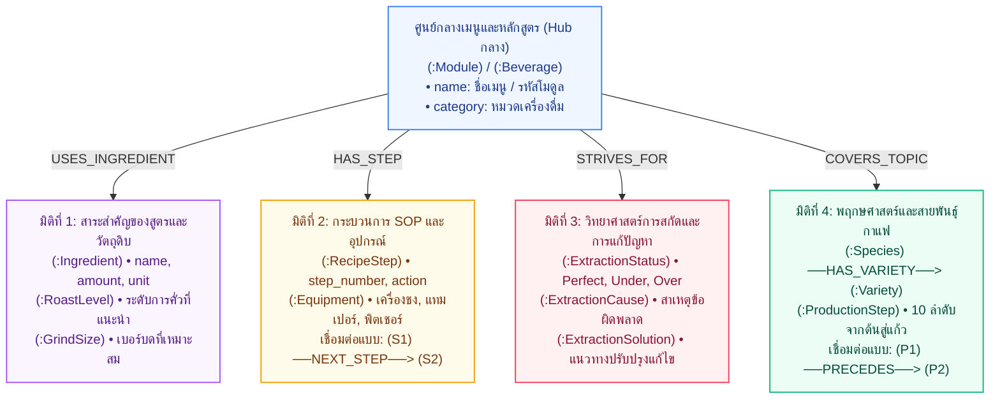

# Neo4j Knowledge Graph Schema – คู่มือบาริสต้ามืออาชีพ
> ข้อมูลจากเอกสาร: **คู่มือประกอบการฝึกอบรม หลักสูตร: บาริสต้ามืออาชีพ** (`documents.pdf`)  
> พัฒนาสำหรับระบบ **SmartDoc Assistant – Hybrid GraphRAG LINE Chatbot**

---

## 🏛️ 1. Ontology Diagram (แผนภาพโครงสร้างภววิทยา 4 มิติ)

> **คำจำกัดความ (Terminology Clarity):**
> * **Ontology Diagram (แผนภาพนี้):** คือโครงสร้างมโนทัศน์ (Conceptual Schema / Data Model) แสดงประเภทของ Entity (Classes) และความสัมพันธ์ทางความหมาย (Semantic Relations) ของศาสตร์บาริสต้า ออกแบบตามสไตล์สไลด์นำเสนอ 4 มิติ
> * **Knowledge Graph (ภาพใน Neo4j Browser):** คือเครือข่ายข้อมูลจริง (Instances) ที่บรรจุข้อมูลครบทั้ง 53 หน้า รวม 359 โหนด และ 773 เส้นความสัมพันธ์
> * **System Architecture Diagram:** คือแผนภาพสถาปัตยกรรมระบบทางเทคนิค (Pipeline จาก Ingestion $\rightarrow$ Neo4j/FAISS $\rightarrow$ Hybrid RAG $\rightarrow$ LINE Webhook)

โครงสร้าง Ontology ขององค์ความรู้บาริสต้า ออกแบบโดยมี **ศูนย์กลางหลักสูตร / เมนูเครื่องดื่ม** และแตกแขนงออกเป็น **4 มิติหลัก (4 Dimensions)**:



---

## 📊 2. ภาพรวม Knowledge Graph ในระบบ

* **ขอบเขตเนื้อหา:** คู่มือประกอบการฝึกอบรม หลักสูตร: บาริสต้ามืออาชีพ (5 โมดูล, 53 หน้า)
* **สถิติในฐานข้อมูล:** **359 โหนด (Nodes)** และ **773 เส้นความสัมพันธ์ (Relationships)**
* **กระบวนการสร้างกราฟ (Data Ingestion Pipeline):**
  * `PDF` $\rightarrow$ `SBERT (paraphrase-multilingual-MiniLM-L12-v2)` + `Ollama LLM (qwen2.5:7b)` $\rightarrow$ `Domain Ontology` $\rightarrow$ `Neo4j`
  * **โหมดปกติ (Fast Mode):** `python feed_graph.py` (ใช้ SBERT Matrix ประมวลผลเร็วใน 3-5 วินาที)
  * **โหมด LLM สมบูรณ์ (LLM-Enriched Mode):** `python feed_graph.py --llm` (เรียกใช้ `qwen2.5:7b` สรุปเนื้อหาทั้ง 53 หน้าลงใน `page_knowledge.json`)

### สรุป 5 หมวดหมู่ในเอกสาร PDF (Modules):
1. **หมวดที่ 1: ความรู้เบื้องต้นเกี่ยวกับเมล็ดกาแฟ (หน้า 3-19)**
   * พฤกษศาสตร์, สายพันธุ์ (Arabica, Robusta, Peaberry), 10 ขั้นตอนจากต้นสู่แก้ว, ระดับการคั่ว (Agtron), ระดับการบด
2. **หมวดที่ 2: เคล็ดลับการชงกาแฟ หลักการและวิธีการ (หน้า 20-31)**
   * วิทยาศาสตร์การสกัด (Extraction), การวินิจฉัยปัญหา Perfect vs Under vs Over Extraction, สาเหตุและวิธีแก้ไข
3. **หมวดที่ 3: ประวัติความเป็นมาและศาสตร์ของลาเต้อาร์ต (หน้า 32-36)**
   * ประวัติศาสตร์, วิทยาศาสตร์การสตีมนม (Microfoam), อุณหภูมิที่เหมาะสม (60–65°C), เทคนิค Free Pour และ Etching
4. **หมวดที่ 4: ใบขั้นตอนการปฏิบัติงาน SOP การชงเครื่องดื่ม (หน้า 37-50)**
   * สูตรมาตรฐาน 13 เมนูยอดนิยม (กาแฟร้อน-เย็น), สัดส่วนวัตถุดิบ, อุปกรณ์ และขั้นตอนการทำอย่างละเอียด
5. **หมวดที่ 5: ใบงาน ใบทดสอบ และใบเฉลย (หน้า 51-53)**
   * แบบทดสอบความรู้บาริสต้า เกณฑ์การประเมิน และแนวทางปฏิบัติ

---

## 🎨 3. คำสั่ง Cypher สำหรับแสดงกราฟแยกตามหมวดหมู่ (Module-based Visualization Queries)
> 💡 *นำคำสั่งด้านล่างไปวางใน Neo4j Browser (`http://localhost:7474`) แล้วกด Run จะได้ผลลัพธ์เป็นลูกกลมกราฟสีสวยงาม นำไปแคปภาพใส่สไลด์ได้ทันที*

---

### ☕ หมวดที่ 1: ความรู้เบื้องต้นเกี่ยวกับเมล็ดกาแฟ (หน้า 3–19)

#### 1.1) สายพันธุ์กาแฟและการแตกสายพันธุ์ย่อย (Species & Varieties)
*แสดงสายพันธุ์หลัก (Arabica, Robusta, Peaberry) เชื่อมโยงไปยังสายพันธุ์ย่อย (เช่น Typica, Bourbon, Geisha)*
```cypher
MATCH (s:Species)-[r:HAS_VARIETY]->(v:Variety)
RETURN s, r, v;
```

#### 1.2) 10 ขั้นตอนเส้นทางกาแฟจากต้นสู่แก้ว (From Tree to Cup Pipeline)
*แสดงลำดับขั้นตอนการผลิต 1 $\rightarrow$ 2 $\rightarrow$ ... $\rightarrow$ 10 ที่ร้อยเรียงด้วยเส้น `PRECEDES`*
```cypher
MATCH (p1:ProductionStep)-[r:PRECEDES]->(p2:ProductionStep)
RETURN p1, r, p2;
```

#### 1.3) ระดับการคั่วกาแฟและเบอร์บด (Roast Levels & Grind Sizing)
*แสดงระดับการคั่ว (ค่า Agtron) และขนาดการบดคู่กับอุปกรณ์ที่เหมาะสม*
```cypher
MATCH (r:RoastLevel)
OPTIONAL MATCH (g:GrindSize)
RETURN r, g;
```

---

### 🔬 หมวดที่ 2: วิทยาศาสตร์การสกัดและการวินิจฉัยปัญหา (หน้า 20–31)

#### 2.1) แผนภูมิวินิจฉัยการสกัดสมบูรณ์ vs สกัดน้อย/มากเกินไป (Diagnostic Decision Tree)
*แสดงสถานะการสกัด (Perfect, Under, Over) เชื่อมโยงไปยัง **สาเหตุ (Causes)** และ **วิธีแก้ไข (Solutions)***
```cypher
MATCH (st:ExtractionStatus)-[rc:CAUSED_BY]->(c:ExtractionCause)
OPTIONAL MATCH (st)-[rs:RESOLVED_BY]->(s:ExtractionSolution)
RETURN st, rc, c, rs, s;
```

#### 2.2) เจาะจงดูเฉพาะกรณี Under Extraction (สกัดน้อยเกินไป - รสเปรี้ยวโดด)
```cypher
MATCH (st:ExtractionStatus {status: 'Under Extraction (สกัดน้อยเกินไป)'})-[rc:CAUSED_BY]->(c:ExtractionCause)
OPTIONAL MATCH (st)-[rs:RESOLVED_BY]->(s:ExtractionSolution)
RETURN st, rc, c, rs, s;
```

---

### 🎨 หมวดที่ 3: ศาสตร์ของลาเต้อาร์ตและเทคนิคการเท (หน้า 32–36)

#### 3.1) คลัสเตอร์ลาเต้อาร์ต เทคนิค และเมนูที่เกี่ยวข้อง
*แสดงโหนด Latte Art แตกกิ่งไปยังเทคนิค (Free Pour, Etching) และเมนูเครื่องดื่มที่ต้องใช้ศิลปะฟองนม*
```cypher
MATCH (la:LatteArt)-[r:HAS_TECHNIQUE]->(t:LatteArtTechnique)
OPTIONAL MATCH (b:Beverage)-[rb:APPLIES_TECHNIQUE]->(la)
RETURN la, r, t, b, rb;
```

---

### 📋 หมวดที่ 4: ใบขั้นตอน SOP และสูตรเครื่องดื่มมาตรฐาน 13 เมนู (หน้า 37–50)

#### 4.1) กราฟสูตรเมนูเดี่ยวแบบครบวงจร (เจาะจงเฉพาะเมนู เช่น "กาแฟส้ม")
*แสดงเมนูเชื่อมไปยัง วัตถุดิบ, อุปกรณ์, ขั้นตอนการชง 1 $\rightarrow$ 2 $\rightarrow$ 3..., ระดับการคั่ว และเบอร์บด*
```cypher
MATCH (b:Beverage)
WHERE b.name CONTAINS 'ส้ม'
MATCH (b)-[r]->(target)
OPTIONAL MATCH (target)-[r_next:NEXT_STEP]->(next_step:RecipeStep)
RETURN b, r, target, r_next, next_step;
```
*(💡 สามารถเปลี่ยน `'ส้ม'` เป็นชื่อเมนูอื่น เช่น `'เอสเพรสโซ'`, `'ลาเต้'`, `'คาปูชิโน'`, `'มอคค่า')*

#### 4.2) กราฟเปรียบเทียบเมนูกาแฟร้อน vs กาแฟเย็น (Menu Categories)
*แสดงเมนูทั้งหมด 13 เมนู แยกคลัสเตอร์ระหว่าง Hot Coffee และ Cold Coffee เชื่อมโยงไปยังวัตถุดิบ*
```cypher
MATCH (b:Beverage)-[r:USES_INGREDIENT]->(i:Ingredient)
RETURN b, r, i
LIMIT 50;
```

#### 4.3) โฟลว์ขั้นตอนการปฏิบัติงาน SOP (Step-by-Step Flow) ของทุกเมนู
*แสดงเฉพาะลำดับขั้นตอนการชงที่เชื่อมต่อกันด้วย `NEXT_STEP`*
```cypher
MATCH (s1:RecipeStep)-[r:NEXT_STEP]->(s2:RecipeStep)
RETURN s1, r, s2
LIMIT 30;
```

---

### 📝 หมวดที่ 5: แบบทดสอบและแบบประเมินบาริสต้า (หน้า 51–53)

#### 5.1) โครงสร้างใบทดสอบความรู้บาริสต้า (Barista Quiz & Evaluation)
*แสดงโมดูลที่ 5 เชื่อมไปยังโจทย์ข้อสอบและเกณฑ์การประเมินความรู้*
```cypher
MATCH (m:Module {id: 'MOD_05'})-[r:HAS_QUIZ]->(q:QuizQuestion)
RETURN m, r, q;
```

---

### 🌐 ภาพรวมเชิงโครงสร้างเอกสารและระบบรวม (Macro Structure & Full Graph)

#### 1) โครงสร้างเอกสาร: เอกสารหลัก $\rightarrow$ 5 โมดูล $\rightarrow$ หน้า PDF
```cypher
MATCH (d:Document)-[r1:HAS_MODULE]->(m:Module)-[r2:COVERS_PAGE]->(p:Page)
RETURN d, m, p
LIMIT 60;
```

#### 2) กราฟภาพรวมทั้งระบบ (Overview Cluster)
*แสดงคลัสเตอร์ความสัมพันธ์หลักในฐานข้อมูลทั้งหมด (จำกัด 100 เส้น เพื่อความสวยงาม ไม่แน่นจนเกินไป)*
```cypher
MATCH (n)-[r]->(m)
RETURN n, r, m
LIMIT 100;
```

---

> 💡 **ทริคสำหรับจัดภาพใน Neo4j Browser ให้สวยใส่สไลด์:**
> 1. **การจัดวาง:** หลังจากกด Run ผลลัพธ์จะแสดงเป็นกราฟ สามารถคลิกค้างที่วงกลมโหนดแล้วลากจัดตำแหน่งให้เป็นทรงพุ่มหรือทรงกิ่งก้านตามใจชอบ
> 2. **การปรับสีและขนาด:** คลิกที่ชื่อ Label บนแถบพาเนลขวามือใน Neo4j Browser เพื่อเลือกสี (Color) และขนาด (Size) เช่น กำหนดให้ `Beverage` เป็นสีส้ม, `Ingredient` เป็นสีเขียว, `RecipeStep` เป็นสีฟ้าพาสเทล
> 3. **Export รูปภาพ:** สามารถคลิกปุ่ม **Export PNG** หรือ **SVG** ที่มุมขวาบนของหน้าต่างกราฟใน Neo4j เพื่อนำรูปไปแปะในสไลด์ Canva ได้คมชัด 100%

