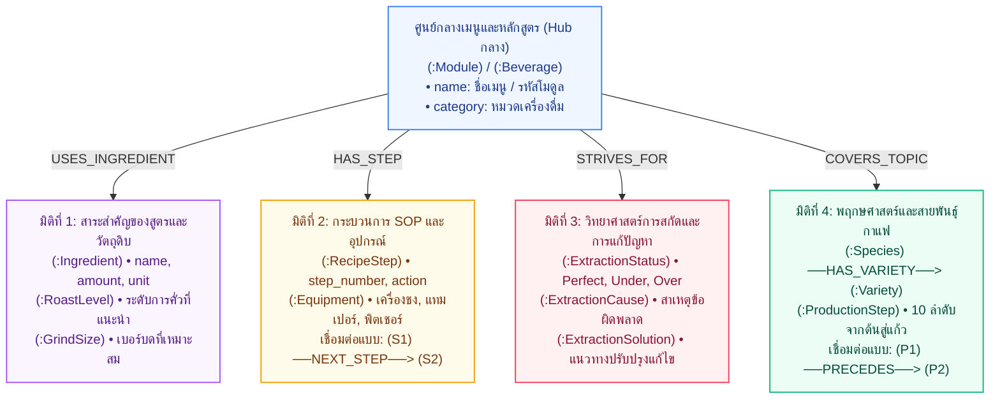

# Neo4j Knowledge Graph Schema – คู่มือบาริสต้ามืออาชีพ

> ข้อมูลจากเอกสาร: **คู่มือประกอบการฝึกอบรม หลักสูตร: บาริสต้ามืออาชีพ** (`documents.pdf`)
> พัฒนาสำหรับระบบ **SmartDoc Assistant – Hybrid GraphRAG LINE Chatbot**

---

## 🏛️ 1. Ontology Diagram (แผนภาพโครงสร้างภววิทยา 4 มิติ)

> **คำจำกัดความ (Terminology Clarity):**
>
> * **Ontology Diagram (แผนภาพนี้):** คือโครงสร้างมโนทัศน์ (Conceptual Schema / Data Model) แสดงประเภทของ Entity (Classes) และความสัมพันธ์ทางความหมาย (Semantic Relations) ของศาสตร์บาริสต้า ออกแบบตามสไตล์สไลด์นำเสนอ 4 มิติ
> * **Knowledge Graph (ภาพใน Neo4j Browser):** คือเครือข่ายข้อมูลจริง (Instances) ที่บรรจุข้อมูลครบทั้ง 53 หน้า รวม 359 โหนด และ 773 เส้นความสัมพันธ์
> * **System Architecture Diagram:** คือแผนภาพสถาปัตยกรรมระบบทางเทคนิค (Pipeline จาก Ingestion $\rightarrow$ Neo4j/FAISS $\rightarrow$ Hybrid RAG $\rightarrow$ LINE Webhook)

โครงสร้าง Ontology ขององค์ความรู้บาริสต้า ออกแบบโดยมี **ศูนย์กลางหลักสูตร / เมนูเครื่องดื่ม** และแตกแขนงออกเป็น **4 มิติหลัก (4 Dimensions)**:



---

## 📊 2. ภาพรวม Knowledge Graph ในระบบ

* **ขอบเขตเนื้อหา:** คู่มือประกอบการฝึกอบรม หลักสูตร: บาริสต้ามืออาชีพ (5 โมดูล, 53 หน้า)
* **สถิติในฐานข้อมูล:** **359 โหนด (Nodes)** และ **773 เส้นความสัมพันธ์ (Relationships)**
* **กระบวนการสร้างกราฟ (Data Ingestion Pipeline):**
  * `PDF` $\rightarrow$ `SBERT (paraphrase-multilingual-MiniLM-L12-v2)` + `Ollama LLM (qwen2.5:7b)` $\rightarrow$ `Domain Ontology` $\rightarrow$ `Neo4j`
  * **โหมดปกติ (Fast Mode):** `python feed_graph.py` (ใช้ SBERT Matrix ประมวลผลเร็วใน 3-5 วินาที)
  * **โหมด LLM สมบูรณ์ (LLM-Enriched Mode):** `python feed_graph.py --llm` (เรียกใช้ `qwen2.5:7b` สรุปเนื้อหาทั้ง 53 หน้าลงใน `page_knowledge.json`)

### สรุป 5 หมวดหมู่ในเอกสาร PDF (Modules):

1. **หมวดที่ 1: ความรู้เบื้องต้นเกี่ยวกับเมล็ดกาแฟ (หน้า 3-19)**
   * พฤกษศาสตร์, สายพันธุ์ (Arabica, Robusta, Peaberry), 10 ขั้นตอนจากต้นสู่แก้ว, ระดับการคั่ว (Agtron), ระดับการบด
2. **หมวดที่ 2: เคล็ดลับการชงกาแฟ หลักการและวิธีการ (หน้า 20-31)**
   * วิทยาศาสตร์การสกัด (Extraction), การวินิจฉัยปัญหา Perfect vs Under vs Over Extraction, สาเหตุและวิธีแก้ไข
3. **หมวดที่ 3: ประวัติความเป็นมาและศาสตร์ของลาเต้อาร์ต (หน้า 32-36)**
   * ประวัติศาสตร์, วิทยาศาสตร์การสตีมนม (Microfoam), อุณหภูมิที่เหมาะสม (60–65°C), เทคนิค Free Pour และ Etching
4. **หมวดที่ 4: ใบขั้นตอนการปฏิบัติงาน SOP การชงเครื่องดื่ม (หน้า 37-50)**
   * สูตรมาตรฐาน 13 เมนูยอดนิยม (กาแฟร้อน-เย็น), สัดส่วนวัตถุดิบ, อุปกรณ์ และขั้นตอนการทำอย่างละเอียด
5. **หมวดที่ 5: ใบงาน ใบทดสอบ และใบเฉลย (หน้า 51-53)**
   * แบบทดสอบความรู้บาริสต้า เกณฑ์การประเมิน และแนวทางปฏิบัติ

---

## 🎨 3. คำสั่ง Cypher สำหรับแสดงกราฟ (Visualization Queries)

> 💡 *นำคำสั่งด้านล่างไปวางในช่อง Run ของ Neo4j Browser (`http://localhost:7474`) จะได้ผลลัพธ์เป็นลูกกลมกราฟสีสวยงาม นำไปแคปภาพใส่สไลด์ได้ทันที*

---

### 🌐 3.1 คำสั่ง Cypher แสดงภาพรวมทั้งระบบ (System Overview Queries)

#### 1) กราฟคลัสเตอร์ภาพรวมทั้งระบบ (Full Overview Cluster)

*แสดงความสัมพันธ์ภาพรวมของทุกโหนดในฐานข้อมูลทั้งหมด (จำกัด 150 เส้น เพื่อความสวยงามและไม่แน่นเกินไป)*

```cypher
MATCH (n)-[r]->(m)
RETURN n, r, m
LIMIT 150;
```

#### 2) กราฟความเชื่อมโยงข้ามมิติเชิงภววิทยา (Cross-Domain Ontology Overview)

*แสดงศูนย์กลางเมนูเครื่องดื่ม เชื่อมโยงข้ามมิติไปยัง ระดับการคั่ว, เบอร์บด, มาตรฐานการสกัด และศาสตร์ลาเต้อาร์ต*

```cypher
MATCH (b:Beverage)-[r1:REQUIRES_ROAST]->(roast:RoastLevel)
OPTIONAL MATCH (b)-[r2:RECOMMENDS_GRIND]->(grind:GrindSize)
OPTIONAL MATCH (b)-[r3:STRIVES_FOR]->(ex:ExtractionStatus)
OPTIONAL MATCH (b)-[r4:APPLIES_TECHNIQUE]->(la:LatteArt)
RETURN b, r1, roast, r2, grind, r3, ex, r4, la;
```

#### 3) กราฟโครงสร้างสารบัญหลักสูตร (Curriculum & Document Hierarchy)

*แสดงเล่มคู่มือหลัก แตกกิ่งออกเป็น 5 โมดูล และแตกแขนงไปยังหน้า PDF 1–53*

```cypher
MATCH (d:Document)-[r1:HAS_MODULE]->(m:Module)-[r2:COVERS_PAGE]->(p:Page)
RETURN d, r1, m, r2, p
LIMIT 60;
```

#### 4) สรุปยอดสถิติภาพรวมของกราฟทั้งหมด (Aggregated Metrics)

*คำสั่งนับจำนวนโหนดแยกตามแต่ละประเภท (Label):*

```cypher
MATCH (n)
RETURN labels(n)[0] AS Label, count(n) AS TotalNodes
ORDER BY TotalNodes DESC;
```

*คำสั่งนับจำนวนเส้นความสัมพันธ์แยกตามประเภท (Relationship Type):*

```cypher
MATCH ()-[r]->()
RETURN type(r) AS RelationshipType, count(r) AS TotalRelationships
ORDER BY TotalRelationships DESC;
```

---

### 📚 3.2 คำสั่ง Cypher เจาะลึกแยกตามหมวดหมู่ 1–5 (Module-based Queries)

#### ☕ หมวดที่ 1: ความรู้เบื้องต้นเกี่ยวกับเมล็ดกาแฟ (หน้า 3–19)

* **สายพันธุ์กาแฟและการแตกสายพันธุ์ย่อย (Species & Varieties):**
  ```cypher
  MATCH (s:Species)-[r:HAS_VARIETY]->(v:Variety)
  RETURN s, r, v;
  ```
* **10 ขั้นตอนเส้นทางกาแฟจากต้นสู่แก้ว (From Tree to Cup Pipeline):**
  ```cypher
  MATCH (p1:ProductionStep)-[r:PRECEDES]->(p2:ProductionStep)
  RETURN p1, r, p2;
  ```
* **ระดับการคั่วกาแฟและเบอร์บด (Roast Levels & Grind Sizing):**
  ```cypher
  MATCH (r:RoastLevel)
  OPTIONAL MATCH (g:GrindSize)
  RETURN r, g;
  ```

#### 🔬 หมวดที่ 2: วิทยาศาสตร์การสกัดและการวินิจฉัยปัญหา (หน้า 20–31)

* **แผนภูมิวินิจฉัยการสกัดสมบูรณ์ vs สกัดน้อย/มากเกินไป (Diagnostic Decision Tree):**
  ```cypher
  MATCH (st:ExtractionStatus)-[rc:CAUSED_BY]->(c:ExtractionCause)
  OPTIONAL MATCH (st)-[rs:RESOLVED_BY]->(s:ExtractionSolution)
  RETURN st, rc, c, rs, s;
  ```
* **เจาะจงเฉพาะกรณี Under Extraction (สกัดน้อยเกินไป - รสเปรี้ยวโดด):**
  ```cypher
  MATCH (st:ExtractionStatus {status: 'Under Extraction (สกัดน้อยเกินไป)'})-[rc:CAUSED_BY]->(c:ExtractionCause)
  OPTIONAL MATCH (st)-[rs:RESOLVED_BY]->(s:ExtractionSolution)
  RETURN st, rc, c, rs, s;
  ```

#### 🎨 หมวดที่ 3: ศาสตร์ของลาเต้อาร์ตและเทคนิคการเท (หน้า 32–36)

* **คลัสเตอร์ลาเต้อาร์ต เทคนิค และเมนูที่เกี่ยวข้อง:**
  ```cypher
  MATCH (la:LatteArt)-[r:HAS_TECHNIQUE]->(t:LatteArtTechnique)
  OPTIONAL MATCH (b:Beverage)-[rb:APPLIES_TECHNIQUE]->(la)
  RETURN la, r, t, b, rb;
  ```

#### 📋 หมวดที่ 4: ใบขั้นตอน SOP และสูตรเครื่องดื่มมาตรฐาน 13 เมนู (หน้า 37–50)

* **กราฟสูตรเมนูเดี่ยวแบบครบวงจร (ตัวอย่าง: "คาปูชิโน่เย็น"):**
  ```cypher
  MATCH (b:Beverage)
  WHERE b.name CONTAINS 'คาปูชิโน่เย็น'
  MATCH (b)-[r]->(target)
  OPTIONAL MATCH (target)-[r_next:NEXT_STEP]->(next_step:RecipeStep)
  RETURN b, r, target, r_next, next_step;
  ```

  *(💡 สามารถเปลี่ยน `'คาปูชิโน่เย็น'` เป็นชื่อเมนูอื่น เช่น `'คาปูชิโน่ร้อน'`, `'เอสเพรสโซ่'`, `'ลาเต้'`, `'อเมริกาโน่'`, `'มอคค่า')*
* **กราฟเปรียบเทียบเมนูกาแฟร้อน vs กาแฟเย็น (Menu Categories):**
  ```cypher
  MATCH (b:Beverage)-[r:USES_INGREDIENT]->(i:Ingredient)
  RETURN b, r, i
  LIMIT 50;
  ```
* **โฟลว์ขั้นตอนการปฏิบัติงาน SOP (Step-by-Step Flow) ของทุกเมนู:**
  ```cypher
  MATCH (s1:RecipeStep)-[r:NEXT_STEP]->(s2:RecipeStep)
  RETURN s1, r, s2
  LIMIT 30;
  ```

#### 📝 หมวดที่ 5: แบบทดสอบและแบบประเมินบาริสต้า (หน้า 51–53)

* **โครงสร้างใบทดสอบความรู้บาริสต้า (Barista Quiz & Evaluation):**
  ```cypher
  MATCH (m:Module {id: 'MOD_05'})-[r:HAS_QUIZ]->(q:QuizQuestion)
  RETURN m, r, q;
  ```

---

> 💡 **ทริคสำหรับจัดภาพใน Neo4j Browser ให้สวยใส่สไลด์:**
>
> 1. **การจัดวาง:** หลังจากกด Run ผลลัพธ์จะแสดงเป็นกราฟ สามารถคลิกค้างที่วงกลมโหนดแล้วลากจัดตำแหน่งให้เป็นทรงพุ่มหรือทรงกิ่งก้านตามใจชอบ
> 2. **การปรับสีและขนาด:** คลิกที่ชื่อ Label บนแถบพาเนลขวามือใน Neo4j Browser เพื่อเลือกสี (Color) และขนาด (Size) เช่น กำหนดให้ `Beverage` เป็นสีส้ม, `Ingredient` เป็นสีเขียว, `RecipeStep` เป็นสีฟ้าพาสเทล
> 3. **Export รูปภาพ:** สามารถคลิกปุ่ม **Export PNG** หรือ **SVG** ที่มุมขวาบนของหน้าต่างกราฟใน Neo4j เพื่อนำรูปไปแปะในสไลด์ Canva ได้คมชัด 100%

---

## 🔗 4. พจนานุกรมความสัมพันธ์ (Semantic Relationship Dictionary)

ใน Knowledge Graph ความสัมพันธ์ (**Relationship**) ทำหน้าที่เสมือน **"คำกริยา (Verbs)" หรือตรรกะเชื่อมโยง** ระหว่างโหนด (Subject $\xrightarrow{\text{RELATIONSHIP}}$ Object) ทำให้ระบบ Hybrid GraphRAG สามารถสืบค้นข้อมูลเชิงตรรกะ ลำดับขั้นตอน และการวินิจฉัยปัญหาได้อย่างแม่นยำ ไม่เกิดปัญหาภาพหลอน (Zero Hallucination)

### ☕ หมวดที่ 1: ความรู้เบื้องต้นเกี่ยวกับเมล็ดกาแฟ (หน้า 3–19)

| Relationship              | โหนดต้นทาง$\rightarrow$ โหนดปลายทาง  | ความหมายและบริบททางบาริสต้า                                                                                                                                                                                                                                                                                                        |
| :------------------------ | :---------------------------------------------------------- | :------------------------------------------------------------------------------------------------------------------------------------------------------------------------------------------------------------------------------------------------------------------------------------------------------------------------------------------------------------ |
| **`HAS_VARIETY`** | `(:Species)` $\rightarrow$ `(:Variety)`               | **"มีสายพันธุ์ย่อยคือ..."**บอกว่าสายพันธุ์กาแฟหลัก แตกแขนงออกเป็นสายพันธุ์ย่อยอะไรบ้าง เช่น *อาราบิก้า $\rightarrow$ Typica, Bourbon, Geisha*                                                                                                              |
| **`PRECEDES`**    | `(:ProductionStep)` $\rightarrow$ `(:ProductionStep)` | **"ต้องทำก่อนขั้นตอน..." (ลำดับก่อน-หลัง)**บอกกระบวนการผลิต 10 ขั้นตอนจากต้นสู่แก้ว เช่น *การปลูก $\rightarrow$ เก็บเกี่ยว $\rightarrow$ แปรรูป $\rightarrow$ สีคัดแยก $\rightarrow$ คั่ว $\rightarrow$ บด $\rightarrow$ ชง* |

### 🔬 หมวดที่ 2: วิทยาศาสตร์การสกัดและการวินิจฉัยปัญหา (หน้า 20–31)

| Relationship              | โหนดต้นทาง$\rightarrow$ โหนดปลายทาง        | ความหมายและบริบททางบาริสต้า                                                                                                                                                                                                                                                         |
| :------------------------ | :---------------------------------------------------------------- | :------------------------------------------------------------------------------------------------------------------------------------------------------------------------------------------------------------------------------------------------------------------------------------------------------------- |
| **`CAUSED_BY`**   | `(:ExtractionStatus)` $\rightarrow$ `(:ExtractionCause)`    | **"เกิดจากสาเหตุข้อผิดพลาดคือ..."**ใช้ในการวินิจฉัยปัญหา เช่น ปัญหา *Under Extraction* (กาแฟเปรี้ยว ไหลเร็ว) เกิดจากสาเหตุ *บดกาแฟหยาบเกินไป*, *น้ำอุณหภูมิต่ำกว่า 88°C* |
| **`RESOLVED_BY`** | `(:ExtractionStatus)` $\rightarrow$ `(:ExtractionSolution)` | **"แก้ไขได้ด้วยวิธี..."**บอกคำแนะนำเชิงปฏิบัติแก่บาริสต้า เช่น เมื่อเกิดปัญหา *Over Extraction* (กาแฟขมไหม้) แก้ไขโดย *ปรับเบอร์บดให้หยาบขึ้น*, *ลดแรงแทมป์*                   |

### 🎨 หมวดที่ 3: ศาสตร์ของลาเต้อาร์ตและเทคนิคการเท (หน้า 32–36)

| Relationship                    | โหนดต้นทาง$\rightarrow$ โหนดปลายทาง | ความหมายและบริบททางบาริสต้า                                                                                                                                                                                                                               |
| :------------------------------ | :--------------------------------------------------------- | :----------------------------------------------------------------------------------------------------------------------------------------------------------------------------------------------------------------------------------------------------------------------------------- |
| **`HAS_TECHNIQUE`**     | `(:LatteArt)` $\rightarrow$ `(:LatteArtTechnique)`   | **"มีเทคนิคการสร้างลายคือ..."**บอกว่าศิลปะลาเต้อาร์ตประกอบด้วย 2 เทคนิคหลัก ได้แก่ *Free Pour (การส่ายเหยือกเทอิสระ)* และ *Etching (การใช้ไม้ปลายแหลมวาด)* |
| **`APPLIES_TECHNIQUE`** | `(:Beverage)` $\rightarrow$ `(:LatteArt)`            | **"ประยุกต์ใช้ศิลปะลาเต้อาร์ต"**บอกว่าเมนูเครื่องดื่มใดบ้างที่ต้องอาศัยเทคนิคฟองนมและลาเต้อาร์ต เช่น *ลาเต้ร้อน*, *คาปูชิโนร้อน*                         |

### 📋 หมวดที่ 4: ใบขั้นตอน SOP และสูตรเครื่องดื่มมาตรฐาน 13 เมนู (หน้า 37–50)

| Relationship                   | โหนดต้นทาง$\rightarrow$ โหนดปลายทาง | ความหมายและบริบททางบาริสต้า                                                                                                                                                                                                                                                                                                                                          |
| :----------------------------- | :--------------------------------------------------------- | :---------------------------------------------------------------------------------------------------------------------------------------------------------------------------------------------------------------------------------------------------------------------------------------------------------------------------------------------------------------------------------------------- |
| **`USES_INGREDIENT`**  | `(:Beverage)` $\rightarrow$ `(:Ingredient)`          | **"ใช้วัตถุดิบและสัดส่วน..."**บอกส่วนผสมที่แน่นอน เช่น คาปูชิโน่เย็น ใช้ *เอสเพรสโซ่ช็อต 2 ช็อต*, *นมสดเย็นผสมนมข้นหวาน 60 ml*, *โฟมนมเย็นเนียนนุ่ม เต็มขอบแก้ว*, *ผงโกโก้ เล็กน้อย* พร้อม Property `amount` และ `unit` |
| **`USES_EQUIPMENT`**   | `(:Beverage)` $\rightarrow$ `(:Equipment)`           | **"ต้องใช้อุปกรณ์ในการทำคือ..."**บอกอุปกรณ์ประจำเมนู เช่น *เครื่องชง Espresso*, *ก้านชง (Portafilter)*, *แทมเปอร์*, *ถ้วยตวง*                                                                                                                                                                        |
| **`HAS_STEP`**         | `(:Beverage)` $\rightarrow$ `(:RecipeStep)`          | **"มีขั้นตอนการชงคือ..."**บอกว่าเมนูนั้นประกอบด้วยขั้นตอนการปฏิบัติงานอะไรบ้าง                                                                                                                                                                                                                                       |
| **`NEXT_STEP`**        | `(:RecipeStep)` $\rightarrow$ `(:RecipeStep)`        | **"ทำเสร็จแล้วต้องทำขั้นต่อไปคือ..." (Sequential SOP Workflow)**ร้อยเรียงขั้นตอน SOP จาก 1 $\rightarrow$ 2 $\rightarrow$ 3 $\rightarrow$ ... เพื่อให้บาริสต้าทำตามลำดับขั้นตอน ไม่ข้ามสเต็ป                                                                                            |
| **`REQUIRES_ROAST`**   | `(:Beverage)` $\rightarrow$ `(:RoastLevel)`          | **"ต้องใช้เมล็ดกาแฟระดับการคั่ว..."**ระบุความเหมาะสมของเมล็ด เช่น เมนูเย็นส่วนใหญ่แนะนำ *คั่วกลาง (Medium Roast)* หรือ *คั่วเข้ม*                                                                                                                                                     |
| **`RECOMMENDS_GRIND`** | `(:Beverage)` $\rightarrow$ `(:GrindSize)`           | **"แนะนำให้บดกาแฟเบอร์..."**ระบุขนาดของผงกาแฟ เช่น *บดค่อนไปทางละเอียด ประมาณน้ำตาลทราย* สำหรับเครื่องชงเอสเพรสโซ                                                                                                                                                                     |
| **`STRIVES_FOR`**      | `(:Beverage)` $\rightarrow$ `(:ExtractionStatus)`    | **"มุ่งหวังมาตรฐานการสกัดระดับ..."**เป้าหมายการชงของทุกเมนูต้องได้การสกัดแบบ *Espresso Perfect (รสกลมกล่อม ครีมม่าสีทอง)*                                                                                                                                                                      |

### 📝 หมวดที่ 5 & โครงสร้างเอกสาร (Document Macro Structure)

| Relationship                | โหนดต้นทาง$\rightarrow$ โหนดปลายทาง | ความหมายและบริบท                                                                                                                                                              |
| :-------------------------- | :--------------------------------------------------------- | :-------------------------------------------------------------------------------------------------------------------------------------------------------------------------------------------- |
| **`HAS_QUIZ`**      | `(:Module)` $\rightarrow$ `(:QuizQuestion)`          | **"มีข้อสอบประเมินผลประจำหมวดคือ..."** (เชื่อมโมดูลที่ 5 เข้ากับแบบทดสอบวัดระดับบาริสต้า)                     |
| **`HAS_MODULE`**    | `(:Document)` $\rightarrow$ `(:Module)`              | **"แบ่งออกเป็นหมวดวิชา..."** (เล่มคู่มือประกอบด้วย Module 1 ถึง Module 5)                                                                     |
| **`COVERS_PAGE`**   | `(:Module)` $\rightarrow$ `(:Page)`                  | **"ครอบคลุมหน้า..."** (บอกว่าโมดูลนั้นๆ อยู่ที่หน้าไหนถึงหน้าไหนในเล่ม PDF)                                                   |
| **`CONTAINS_PAGE`** | `(:Document)` $\rightarrow$ `(:Page)`                | **"บรรจุหน้าเอกสาร..."** (เล่มเอกสารบรรจุหน้า 1 ถึง 53)                                                                                            |
| **`HAS_KEYWORD`**   | `(:Page)` $\rightarrow$ `(:Keyword)`                 | **"มีคำสำคัญเด่นในหน้านั้นคือ..."** (ผลลัพธ์จากการคำนวณของ SBERT เชื่อมหน้าเอกสารเข้ากับประเด็นสำคัญ) |
