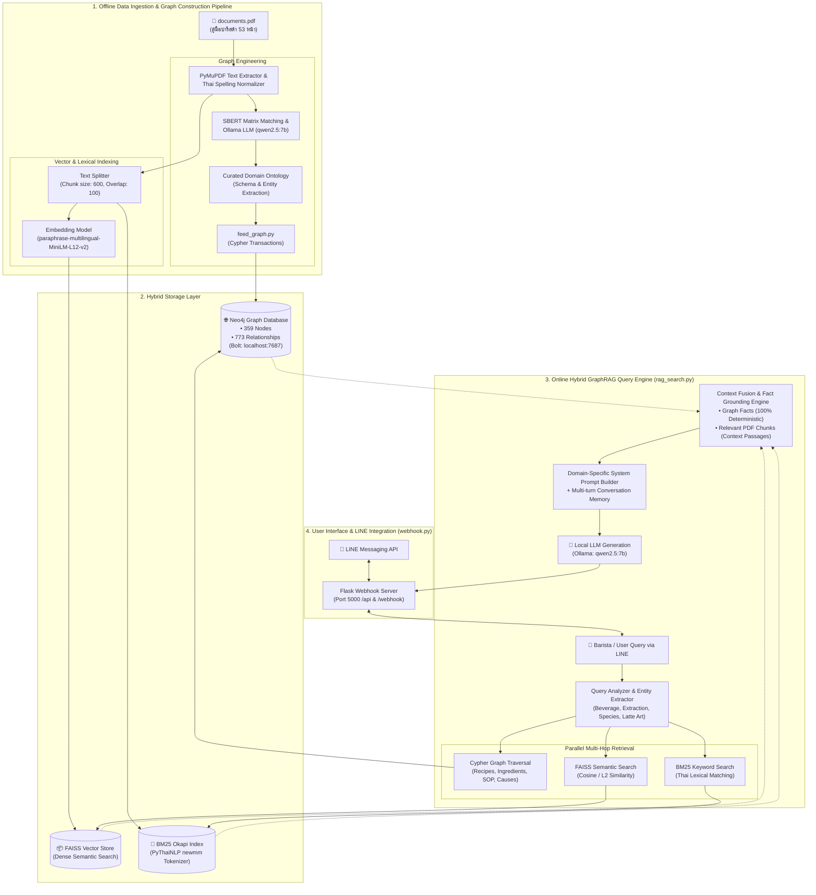
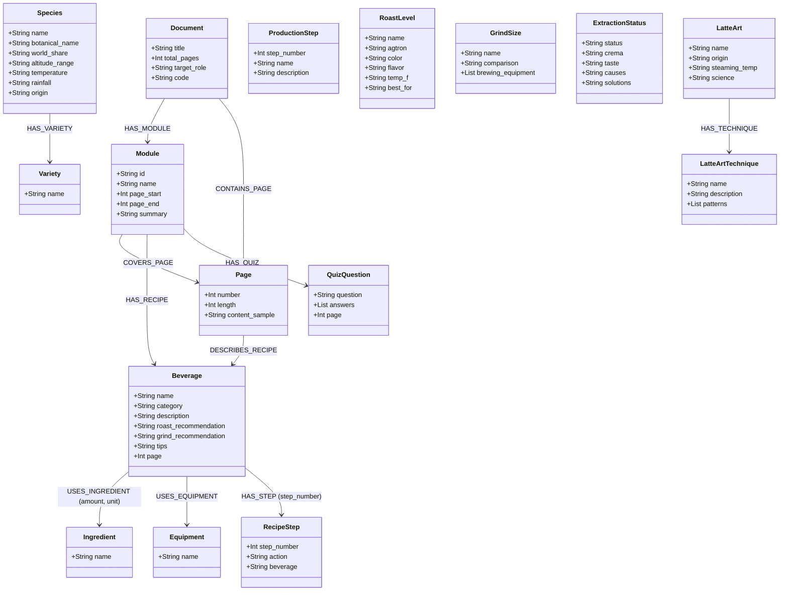

# เอกสารสรุป Knowledge Graph & Architecture: ระบบ SmartDoc Assistant (คู่มือบาริสต้ามืออาชีพ)

เอกสารฉบับนี้จัดทำขึ้นเพื่อสรุปภาพรวมทางเทคนิคและสถาปัตยกรรมของ **Knowledge Graph** และระบบ **Hybrid GraphRAG** ที่พัฒนาขึ้นจากคู่มือ *"หลักสูตร: บาริสต้ามืออาชีพ"* (ความยาว 53 หน้า) สำหรับโครงการ SmartDoc Assistant (Course: 241-351 AI for Social Good)

---

## 1. ขอบเขตเนื้อหาของระบบ (Knowledge Scope)

ฐานความรู้ของระบบถูกสกัดและสังเคราะห์โดยตรงจากเอกสารแม่แบบ `documents.pdf` (*คู่มือประกอบการฝึกอบรม หลักสูตร: บาริสต้ามืออาชีพ* จำนวน 53 หน้า) ครอบคลุมองค์ความรู้ด้านกาแฟตั้งแต่ต้นน้ำถึงปลายน้ำ แบ่งเป็น 5 โมดูลหลัก ดังนี้:

| โมดูล | ชื่อโมดูล | ช่วงหน้า | ขอบเขตเนื้อหาสำคัญ |
|---|---|---|---|
| **MOD_01** | ความรู้เบื้องต้นเกี่ยวกับเมล็ดกาแฟ | หน้า 3 – 19 | • ประวัติความเป็นมาและแหล่งกำเนิดกาแฟโลก<br>• สายพันธุ์กาแฟหลัก (Arabica, Robusta, Peaberry)<br>• สายพันธุ์ย่อยยอดนิยม (Typica, Bourbon, Caturra, Catuai, Geisha, ฯลฯ)<br>• ปัจจัยการเพาะปลูก: ระดับความสูง, อุณหภูมิ, ปริมาณน้ำฝน<br>• 10 ขั้นตอนการผลิตจากต้นสู่แก้ว (ปลูก, เก็บเกี่ยว, แปรรูป, สีเมล็ด, คัดเกรด, Cupping, คั่ว, บด, ชง)<br>• ระดับการคั่ว (Light, Medium, Dark/French Roast) และสเกล Agtron<br>• เบอร์บดกาแฟ 5 ระดับ (Extra Fine ถึง Coarse) และการเลือกใช้อุปกรณ์ชง |
| **MOD_02** | เคล็ดลับการชงกาแฟ หลักการและวิธีการ | หน้า 20 – 31 | • วิทยาศาสตร์การสกัดกาแฟ (Extraction Parameters)<br>• คุณภาพน้ำ, อุณหภูมิน้ำในการสกัด (88–95°C), แรงดัน (9 บาร์)<br>• การประเมินสถานะการสกัด: **Espresso Perfect**, **Under Extraction** (สกัดน้อยเกินไป), **Over Extraction** (สกัดมากเกินไป)<br>• อาการของครีมม่า (Crema), รสชาติ (Sensory Profile), สาเหตุ และแนวทางแก้ไข |
| **MOD_03** | ประวัติความเป็นมาและศาสตร์ของลาเต้อาร์ต | หน้า 32 – 36 | • ประวัติและต้นกำเนิด Latte Art (David Schomer / Espresso Vivace, Seattle)<br>• การแข่งขัน World Latte Art Championship (WLAC)<br>• วิทยาศาสตร์ฟองนม (Microfoam): โปรตีนเคซีนและไขมันนมที่อุณหภูมิ 60–65°C<br>• เทคนิคการเท 2 รูปแบบ: Free Pour (ลาย Heart, Tulip, Rosetta) และ Etching (การวาดลาย) |
| **MOD_04** | ใบขั้นตอนการปฏิบัติงาน การชงกาแฟร้อนและเย็น (SOP) | หน้า 37 – 50 | • สูตรและสัดส่วนมาตรฐานของเมนูกาแฟ 13 เมนู (ร้อน 5 เมนู, เย็น 8 เมนู)<br>• อัตราส่วนวัตถุดิบ (Dose, Yield, สัดส่วนนม/น้ำเชื่อม/น้ำผลไม้)<br>• อุปกรณ์เฉพาะทางและเครื่องบด/เครื่องชงประจำเมนู<br>• ขั้นตอน Standard Operating Procedure (SOP) ทีละสเต็ป<br>• เทคนิคและ Barista Tips ประจำแต่ละเมนู |
| **MOD_05** | ใบงาน ใบทดสอบ และใบเฉลย | หน้า 51 – 53 | • แบบทดสอบวัดระดับความรู้บาริสต้า<br>• Checklist ตรวจสอบทักษะการชงและการจัดการบาร์<br>• แนวทางปฏิบัติและเฉลยคำตอบมาตรฐาน |

---

## 2. แผนภาพสถาปัตยกรรมทั้งระบบ (Architecture Diagram)

ระบบทำงานร่วมกันระหว่าง **Knowledge Graph (Neo4j)**, **Dense Vector Retrieval (FAISS)**, **Lexical Search (BM25 + PyThaiNLP)** และ **LINE Messaging API Webhook** เพื่อให้ได้คำตอบที่ถูกต้องแม่นยำ ไม่เกิดปัญหาภาพหลอน (Zero Hallucination)



---

## 3. การออกแบบภววิทยาและสกีมาของกราฟ (Domain Ontology & Schema Design)

Knowledge Graph ถูกออกแบบเพื่อเชื่อมโยงองค์ความรู้ 2 มิติเข้าด้วยกัน:
1. **มิติเชิงโครงสร้างเอกสาร (Document Macro Structure)**: เชื่อมโยงระดับ Document $\rightarrow$ Module $\rightarrow$ Page เพื่อรองรับการสืบค้นย้อนกลับไปยังหน้าอ้างอิงต้นฉบับ
2. **มิติเชิงองค์ความรู้เฉพาะทาง (Domain Ontology Structure)**: เชื่อมโยงความสัมพันธ์ของศาสตร์บาริสต้า (สายพันธุ์, การคั่ว, การบด, วิทยาศาสตร์การสกัด, ลาเต้อาร์ต, เมนูเครื่องดื่ม, วัตถุดิบ, อุปกรณ์ และขั้นตอน SOP)

### แผนภาพโครงสร้างภววิทยา (Domain Ontology Diagram)



---

## 4. ภาพรวมของ Knowledge Graph ที่ได้ (Graph Highlights & Subgraphs)

Knowledge Graph ที่ถูกสร้างขึ้นใน Neo4j มีจุดเด่นในการจัดเก็บความสัมพันธ์แบบแม่นยำสูง (Deterministic Knowledge) แยกเป็น 6 ซับกราฟหลัก:

### 4.1 ซับกราฟสูตรเครื่องดื่มมาตรฐานและขั้นตอน SOP (Beverage & Recipe Subgraph)
- บรรจุเมนูเครื่องดื่มมาตรฐานครบทั้ง **13 เมนู** (5 เมนูร้อน และ 8 เมนูเย็น)
- **เมนูร้อน**: เอสเพรสโซ่ร้อน, อเมริกาโน่ร้อน, ลาเต้ร้อน, คาปูชิโน่ร้อน, มอคค่าร้อน
- **เมนูเย็น**: อเมริกาโน่เย็น, ลาเต้เย็น, เอสเพรสโซ่เย็นสไตล์ไทย, กาแฟส้ม, กาแฟพีช, ลาเต้มิ้นท์, กาแฟน้ำผึ้งมะนาว, Iced Coffee Lemonade
- แต่ละเมนูเชื่อมโยงไปยัง:
  - วัตถุดิบ (`Ingredient`) พร้อมระบุ Property `amount` และ `unit` ชัดเจน
  - อุปกรณ์ (`Equipment`) เช่น ก้านชง, แทมเปอร์, Moka Pot, พิตเชอร์
  - ขั้นตอนการทำ (`RecipeStep`) เรียงลำดับ 1, 2, 3... ตามขั้นตอนการทำงานจริง (SOP)
  - คำแนะนำระดับการคั่ว (`roast_recommendation`), ระดับการบด (`grind_recommendation`) และเคล็ดลับบาริสต้า (`tips`)

### 4.2 ซับกราฟการวินิจฉัยปัญหาการสกัดเอสเปรสโซ (Extraction Diagnosis Subgraph)
- โมเดลสถานะการสกัด 3 รูปแบบ:
  1. **Espresso Perfect**: ครีมม่าสีน้ำตาลทองหนาเนียน รสชาติกลมกล่อม หวานฉ่ำ บอดี้เต็มคำ
  2. **Under Extraction**: น้ำกาแฟไหลเร็ว ครีมม่าสีซีดบาง รสเปรี้ยวโดด ฝาดเฝื่อน ขาดความหวาน $\rightarrow$ แก้ด้วยการบดให้ละเอียดขึ้น เพิ่มผงกาแฟ แทมป์ให้แน่นขึ้น หรือเพิ่มอุณหภูมิน้ำ
  3. **Over Extraction**: น้ำกาแฟหยดช้า ครีมม่าสีเข้มจัดจนดำ มีจุดไหม้ รสขมจัดไหม้คอ $\rightarrow$ แก้ด้วยการปรับเบอร์บดให้หยาบขึ้น ลดแรงแทมป์ หรือคุมอุณหภูมิไม่เกิน 95°C

### 4.3 ซับกราฟพฤกษศาสตร์และสายพันธุ์กาแฟ (Botany & Species Subgraph)
- จำแนก 3 กลุ่มหลัก: **Arabica**, **Robusta**, และ **Peaberry (กาแฟโทน)**
- เก็บคุณสมบัติเชิงเปรียบเทียบ: สัดส่วนในตลาดโลก, ระดับความสูงเหนือระดับน้ำทะเลที่เหมาะสม (Elevation), อุณหภูมิ, ปริมาณน้ำฝน และรสชาติ
- เชื่อมโยงสายพันธุ์ย่อย (Varieties) เช่น Typica, Bourbon, Caturra, Catuai, Geisha, Catimor, Maragogype, Pacamara

### 4.4 ซับกราฟกระบวนการผลิต 10 ขั้นตอน (Tree-to-Cup Processing Subgraph)
- ลำดับขั้นตอนตั้งแต่ต้นน้ำสู่ปลายน้ำอย่างเป็นระบบ:
  1. การปลูก (Planting) $\rightarrow$ 2. การเก็บเกี่ยว (Harvesting) $\rightarrow$ 3. การแปรรูป (Processing: Wet/Dry/Honey) $\rightarrow$ 4. การตากแห้ง (Drying) $\rightarrow$ 5. การกะเทาะเปลือก (Hulling) $\rightarrow$ 6. การคัดเกรด (Grading) $\rightarrow$ 7. การชิมทดสอบ (Cupping) $\rightarrow$ 8. การคั่ว (Roasting) $\rightarrow$ 9. การบด (Grinding) $\rightarrow$ 10. การชง (Brewing)

### 4.5 ซับกราฟระดับการคั่วและขนาดการบด (Roast Levels & Grind Sizes)
- **ระดับการคั่ว**: คั่วอ่อน (Light Roast - Agtron 70-90), คั่วกลาง (Medium Roast - Agtron 50-69), คั่วเข้ม (Dark/French Roast - Agtron 30-49)
- **ขนาดการบด 5 ระดับ**: ละเอียดมาก (Extra Fine - Turkish), ละเอียด (Fine - Espresso), ปานกลาง (Medium - Drip/Syphon), หยาบ (Coarse - French Press/Cold Brew), หยาบมาก (Extra Coarse) พร้อมคำแนะนำการจับคู่อุปกรณ์

### 4.6 ซับกราฟศิลปะลาเต้อาร์ต (Latte Art & Milk Chemistry Subgraph)
- บันทึกประวัติ David Schomer (Espresso Vivace, Seattle)
- วิทยาศาสตร์การสตรีมนม Microfoam: การทำงานของโปรตีนและไขมันที่อุณหภูมิวิกฤต **60–65°C** (ห้ามเกิน 70°C เพราะจะสูญเสียความหวานธรรมชาติและโปรตีนเสียสภาพ)
- เทคนิคการเท Free Pour (Heart, Tulip, Rosetta) และเทคนิค Etching

---

## 5. สรุปจำนวนโหนดและเส้นความสัมพันธ์ในระบบ (Graph Metrics)

ข้อมูลจากการตรวจสอบฐานข้อมูล Neo4j จริง (`check_graph.py`):

```
=================================================================
📊 NEO4J KNOWLEDGE GRAPH METRICS (VERIFIED)
=================================================================
📌 Total Nodes:         359 โหนด
🔗 Total Relationships: 773 เส้นความสัมพันธ์
```

### 5.1 ตารางแจกแจงจำนวนโหนดแยกตาม Node Label

| อันดับ | Node Label | จำนวนโหนด (Nodes) | รายละเอียดและความหมายในระบบ |
|:---:|---|:---:|---|
| 1 | `Entity` | **103** | เอนทิตีคำสำคัญทั่วไปที่ใช้สำหรับการทำ Multi-hop Entity Linking |
| 2 | `Page` | **53** | โหนดแทนหน้าเอกสารจริงใน `documents.pdf` (หน้า 1 ถึง 53) |
| 3 | `RecipeStep` | **47** | ขั้นตอนการปฏิบัติงานจริง (SOP Action Steps) ของแต่ละเมนูเครื่องดื่ม |
| 4 | `Keyword` | **31** | คีย์เวิร์ดเฉพาะทางที่ SBERT Matrix สกัดได้ |
| 5 | `Ingredient` | **29** | ส่วนผสมและวัตถุดิบ (เมล็ดกาแฟ, นมสด, นมข้น, น้ำส้ม, ไซรัป, น้ำเชื่อม) |
| 6 | `Equipment` | **25** | อุปกรณ์และเครื่องมือของบาริสต้า (ก้านชง, เครื่องชง, แทมเปอร์, Moka pot) |
| 7 | `Beverage` | **13** | สูตรเมนูเครื่องดื่มกาแฟมาตรฐาน (5 เมนูร้อน และ 8 เมนูเย็น) |
| 8 | `ProductionStep` | **10** | ขั้นตอนการผลิตกาแฟ 10 ขั้นตอนจากต้นสู่แก้ว (Tree to Cup) |
| 9 | `Variety` | **9** | สายพันธุ์ย่อยของกาแฟ (Typica, Bourbon, Caturra, Geisha, ฯลฯ) |
| 10 | `ExtractionCause` | **8** | สาเหตุข้อผิดพลาดในการสกัด (Under/Over Extraction) |
| 11 | `ExtractionSolution`| **6** | แนวทางการแก้ไขปัญหาการสกัด |
| 12 | `Module` | **5** | หน่วยการเรียนรู้หลักตามหลักสูตร (MOD_01 ถึง MOD_05) |
| 13 | `GrindSize` | **5** | ระดับการบดกาแฟ 5 ระดับ (Extra Fine ถึง Coarse) |
| 14 | `Species` | **3** | สายพันธุ์หลักทางชีววิทยา (Arabica, Robusta, Peaberry) |
| 15 | `RoastLevel` | **3** | ระดับการคั่วกาแฟ (คั่วอ่อน, คั่วกลาง, คั่วเข้ม/French Roast) |
| 16 | `ExtractionStatus` | **3** | สถานะการสกัดกาแฟ (Espresso Perfect, Under Extraction, Over Extraction) |
| 17 | `LatteArtTechnique`| **2** | เทคนิคการทำลาเต้อาร์ต (Free Pour, Etching) |
| 18 | `QuizQuestion` | **2** | ข้อสอบวัดผลการฝึกอบรมและแนวทางการตอบ |
| 19 | `Document` | **1** | โหนดแม่ระบุข้อมูลอภิพันธุ์ของคู่มือหลักสูตรบาริสต้ามืออาชีพ |
| 20 | `LatteArt` | **1** | โหนดองค์ความรู้ภาพรวมของศาสตร์ลาเต้อาร์ตและเคมีของนม |
| | **รวมทั้งหมด (Total)** | **359** | โหนดในฐานข้อมูล Neo4j |

### 5.2 ตารางแจกแจงจำนวนเส้นความสัมพันธ์แยกตาม Relationship Type

| อันดับ | Relationship Type | จำนวนเส้น (Rels) | ทิศทางการเชื่อมโยง (Source $\rightarrow$ Target) | คำอธิบายความสัมพันธ์ |
|:---:|---|:---:|---|---|
| 1 | `HAS_KEYWORD` | **260** | `(:Page) $\rightarrow$ (:Keyword)` | คีย์เวิร์ดเฉพาะทางที่ SBERT สกัดตามหน้า (Top 5 ต่อหน้า) |
| 2 | `AS_ENTITY` | **103** | `(:Target) $\rightarrow$ (:Entity)` | เชื่อมโหนดเฉพาะทางเข้ากับเอนทิตีแกนกลาง |
| 3 | `CONTAINS_PAGE` | **53** | `(:Document) $\rightarrow$ (:Page)` | เชื่อมเล่มเอกสารหลักเข้าสู่หน้าเอกสารทั้ง 53 หน้า |
| 4 | `USES_EQUIPMENT` | **52** | `(:Beverage) $\rightarrow$ (:Equipment)` | ระบุอุปกรณ์เครื่องมือที่ต้องใช้ในแต่ละเมนู |
| 5 | `COVERS_PAGE` | **51** | `(:Module) $\rightarrow$ (:Page)` | ระบุขอบเขตหน้าของแต่ละโมดูลหลักสูตร |
| 6 | `HAS_STEP` | **47** | `(:Beverage) $\rightarrow$ (:RecipeStep)` | เชื่อมโยงเมนูเครื่องดื่มกับขั้นตอนการทำทีละสเต็ป |
| 7 | `USES_INGREDIENT` | **46** | `(:Beverage) $\rightarrow$ (:Ingredient)` | ระบุวัตถุดิบและสัดส่วน (ปริมาณ, หน่วย) ของเมนู |
| 8 | `NEXT_STEP` | **34** | `(:RecipeStep) $\rightarrow$ (:RecipeStep)` | ลำดับขั้นตอนการชง SOP เป็น Process Flow |
| 9 | `RECOMMENDS_GRIND` | **25** | `(:Beverage) $\rightarrow$ (:GrindSize)` | แนะนำเบอร์บดที่เหมาะสมกับเมนูเครื่องดื่ม |
| 10 | `REQUIRES_ROAST` | **17** | `(:Beverage) $\rightarrow$ (:RoastLevel)` | แนะนำระดับการคั่วที่เหมาะสมกับเมนูเครื่องดื่ม |
| 11 | `HAS_RECIPE` | **13** | `(:Module) $\rightarrow$ (:Beverage)` | ระบุว่าโมดูลหลักสูตร (MOD_04) ประกอบด้วยสูตรใดบ้าง |
| 12 | `DESCRIBES_RECIPE` | **13** | `(:Page) $\rightarrow$ (:Beverage)` | ระบุหน้าเอกสารต้นทางที่อธิบายสูตรเมนูนั้นๆ |
| 13 | `STRIVES_FOR` | **13** | `(:Beverage) $\rightarrow$ (:ExtractionStatus)` | เชื่อมโยงเมนูกับมาตรฐานการสกัดกาแฟ |
| 14 | `HAS_VARIETY` | **9** | `(:Species) $\rightarrow$ (:Variety)` | เชื่อมสายพันธุ์หลักเข้ากับสายพันธุ์ย่อย |
| 15 | `PRECEDES` | **9** | `(:ProductionStep) $\rightarrow$ (:ProductionStep)` | ลำดับ 10 ขั้นตอนการผลิตจากต้นสู่แก้ว |
| 16 | `CAUSED_BY` | **8** | `(:ExtractionStatus) $\rightarrow$ (:ExtractionCause)` | เชื่อมโยงปัญหาการสกัดเข้ากับสาเหตุข้อผิดพลาด |
| 17 | `RESOLVED_BY` | **6** | `(:ExtractionStatus) $\rightarrow$ (:ExtractionSolution)` | เชื่อมโยงปัญหาการสกัดเข้ากับแนวทางแก้ไข |
| 18 | `HAS_MODULE` | **5** | `(:Document) $\rightarrow$ (:Module)` | แบ่งโครงสร้างเอกสารหลักสูตรออกเป็น 5 โมดูล |
| 19 | `APPLIES_TECHNIQUE` | **5** | `(:Beverage) $\rightarrow$ (:LatteArt)` | เชื่อมโยงเมนูนมเข้ากับศาสตร์ลาเต้อาร์ต |
| 20 | `HAS_TECHNIQUE` | **2** | `(:LatteArt) $\rightarrow$ (:LatteArtTechnique)` | เชื่อมศาสตร์ลาเต้อาร์ตเข้ากับเทคนิคการเท |
| 21 | `HAS_QUIZ` | **2** | `(:Module) $\rightarrow$ (:QuizQuestion)` | เชื่อมโยงโมดูลการเรียนรู้เข้ากับแบบทดสอบท้ายบท |
| | **รวมทั้งหมด (Total)** | **773** | ความสัมพันธ์ที่เชื่อมโยงในระบบ |

---

## 6. ข้อดีของการใช้ Knowledge Graph ในระบบ Hybrid GraphRAG

1. **ความถูกต้องระดับ 100% ของสัดส่วนสูตร (Zero Recipe Hallucination)**:
   - ปัญหาหลักของ Vector Search ทั่วไปคือการสับสนเรื่องตัวเลขและสัดส่วน เช่น จำสลับปริมาณน้ำส้มกับกาแฟ หรือลืมวัตถุดิบบางตัว
   - การใช้ Graph Traversal (`USES_INGREDIENT`) ทำให้ได้รายการวัตถุดิบและปริมาณที่แท้จริงส่งตรงเข้า Prompt ของ LLM
2. **การวินิจฉัยปัญหาแบบเชื่อมโยงเหตุผล (Causal Troubleshooting)**:
   - ปัญหาเช่น *"กาแฟเปรี้ยวไหลเร็วเกิดจากอะไรและแก้ยังไง"* ระบบสามารถดึงโหนด `Under Extraction` ที่มี `causes` และ `solutions` ที่ผ่านการตรวจสอบแล้ว ตอบผู้ใช้ได้ทันทีโดยไม่ต้องพึ่งพาการเดาของ LLM
3. **การสืบค้นย้อนกลับไปยังหน้าต้นฉบับ (Auditability & Source Citation)**:
   - ด้วยความสัมพันธ์ `(:Page)-[:DESCRIBES_RECIPE]->(:Beverage)` ระบบสามารถระบุเลขหน้าที่แน่นอนของสูตรใน `documents.pdf` ส่งกลับไปแสดงผลบน LINE Chat ให้ผู้ใช้อ่านทบทวนต่อได้ทันที

---

## 7. คู่มือคำสั่ง Cypher สำหรับเรียกดูและตรวจสอบ Knowledge Graph แต่ละโหนด (Cypher Inspection Guide)

ผู้พัฒนาและผู้ดูแลระบบสามารถใช้คำสั่ง **Cypher Query** ด้านล่างนี้ผ่าน **Neo4j Browser** (`http://localhost:7474`) เพื่อตรวจสอบโครงสร้าง โหนด คุณสมบัติ (Properties) และเส้นความสัมพันธ์ของระบบได้อย่างละเอียด:

> [!TIP]
> **วิธีเปิดใช้งานใน Neo4j Browser:**
> 1. เปิดเว็บเบราว์เซอร์ไปที่ `http://localhost:7474`
> 2. ล็อกอินด้วย Username: `neo4j` และ Password: `password1234`
> 3. คัดลอกคำสั่ง Cypher ด้านล่างไปวางในแถบคำสั่งด้านบน แล้วกด **Ctrl + Enter** (หรือกดปุ่ม Play สีฟ้า)

---

### 7.1 คำสั่งดูภาพรวม Schema และความสัมพันธ์ทั้งระบบ

```cypher
// 1. แผนภาพ Schema ภาพรวมความสัมพันธ์ระหว่าง Label ทั้งหมดในระบบ
CALL db.schema.visualization();
```

```cypher
// 2. สรุปจำนวนโหนดแยกตามแต่ละ Node Label
MATCH (n)
RETURN labels(n)[0] AS node_label, count(n) AS total_nodes
ORDER BY total_nodes DESC;
```

```cypher
// 3. ดูตัวอย่างกราฟและเส้นเชื่อมโยงสุ่ม 100 โหนดแรก (เหมาะกับการดูภาพกราฟสวยงาม)
MATCH (n)-[r]->(m)
RETURN n, r, m
LIMIT 100;
```

---

### 7.2 คำสั่งดูโหนดแยกตามแต่ละประเภท (Node-by-Node Queries)

#### หมวดที่ 1: เมนูเครื่องดื่ม สูตร วัตถุดิบ อุปกรณ์ และขั้นตอน (`Beverage`, `Ingredient`, `Equipment`, `RecipeStep`)

```cypher
// 1.1 ดูรายชื่อเมนูเครื่องดื่มทั้งหมด 13 เมนู พร้อมคำแนะนำการคั่วและการบด
MATCH (b:Beverage)
RETURN b.name AS เมนู,
       b.category AS หมวดหมู่,
       b.roast_recommendation AS ระดับคั่วแนะนำ,
       b.grind_recommendation AS เบอร์บดแนะนำ,
       b.tips AS เคล็ดลับบาริสต้า,
       b.page AS หน้าในเอกสาร;
```

```cypher
// 1.2 ดูกราฟแบบ Interactive: เมนูเครื่องดื่มเชื่อมโยงไปยัง วัตถุดิบ + อุปกรณ์ + ขั้นตอน
MATCH (b:Beverage)-[r1:USES_INGREDIENT]->(i:Ingredient)
OPTIONAL MATCH (b)-[r2:USES_EQUIPMENT]->(eq:Equipment)
OPTIONAL MATCH (b)-[r3:HAS_STEP]->(st:RecipeStep)
RETURN b, r1, i, r2, eq, r3, st
LIMIT 60;
```

```cypher
// 1.3 เจาะจงดูเมนูใดเมนูหนึ่งแบบครบวงจร (ตัวอย่าง: "คาปูชิโน่เย็น")
MATCH (b:Beverage {name: 'คาปูชิโน่เย็น (Iced Cappuccino)'})
OPTIONAL MATCH (b)-[r1:USES_INGREDIENT]->(i:Ingredient)
OPTIONAL MATCH (b)-[r2:USES_EQUIPMENT]->(eq:Equipment)
OPTIONAL MATCH (b)-[r3:HAS_STEP]->(st:RecipeStep)
RETURN b, r1, i, r2, eq, r3, st;
```

```cypher
// 1.4 ดูตารางสรุปสูตร: รวมวัตถุดิบและขั้นตอนเป็นข้อความพร้อมอ่าน
MATCH (b:Beverage)
OPTIONAL MATCH (b)-[ri:USES_INGREDIENT]->(i:Ingredient)
OPTIONAL MATCH (b)-[:USES_EQUIPMENT]->(eq:Equipment)
OPTIONAL MATCH (b)-[:HAS_STEP]->(st:RecipeStep)
RETURN b.name AS เมนู,
       collect(DISTINCT i.name + ' (' + ri.amount + ' ' + ri.unit + ')') AS วัตถุดิบ,
       collect(DISTINCT eq.name) AS อุปกรณ์,
       collect(DISTINCT toString(st.step_number) + '. ' + st.action) AS ขั้นตอน;
```

```cypher
// 1.5 ดูวัตถุดิบทั้งหมด (Ingredient) และตรวจสอบว่าใช้ในเมนูใดบ้าง
MATCH (i:Ingredient)<-[r:USES_INGREDIENT]-(b:Beverage)
RETURN i.name AS วัตถุดิบ,
       count(b) AS จำนวนเมนูที่ใช้,
       collect(b.name + ' (' + r.amount + ' ' + r.unit + ')') AS รายการเมนู
ORDER BY จำนวนเมนูที่ใช้ DESC;
```

```cypher
// 1.6 ดูอุปกรณ์ทั้งหมด (Equipment) และความถี่ในการใช้งาน
MATCH (eq:Equipment)<-[:USES_EQUIPMENT]-(b:Beverage)
RETURN eq.name AS อุปกรณ์,
       count(b) AS จำนวนเมนูที่ใช้,
       collect(b.name) AS รายชื่อเมนู
ORDER BY จำนวนเมนูที่ใช้ DESC;
```

---

#### หมวดที่ 2: การวินิจฉัยปัญหาการสกัดเอสเปรสโซ (`ExtractionStatus`)

```cypher
// ดูการวิเคราะห์สถานะการสกัดทั้ง 3 รูปแบบ: Perfect, Under, Over Extraction
MATCH (ex:ExtractionStatus)
RETURN ex.status AS สถานะ,
       ex.crema AS ลักษณะครีมม่า,
       ex.taste AS รสชาติและบอดี้,
       ex.causes AS สาเหตุที่ทำให้เกิด,
       ex.solutions AS แนวทางแก้ไข;
```

---

#### หมวดที่ 3: สายพันธุ์กาแฟและพฤกษศาสตร์ (`Species`, `Variety`)

```cypher
// 3.1 ดูกราฟเชื่อมโยงสายพันธุ์หลักเข้ากับสายพันธุ์ย่อย
MATCH (s:Species)-[r:HAS_VARIETY]->(v:Variety)
RETURN s, r, v;
```

```cypher
// 3.2 ดูตารางเปรียบเทียบคุณสมบัติสายพันธุ์ (Arabica vs Robusta vs Peaberry)
MATCH (s:Species)
OPTIONAL MATCH (s)-[:HAS_VARIETY]->(v:Variety)
RETURN s.name AS สายพันธุ์หลัก,
       s.world_share AS สัดส่วนผลผลิตโลก,
       s.origin AS แหล่งกำเนิด,
       s.altitude_range AS ความสูงเหมาะสม,
       s.temperature AS อุณหภูมิ,
       s.rainfall AS ปริมาณน้ำฝน,
       s.characteristics AS โพรไฟล์รสชาติ,
       collect(v.name) AS สายพันธุ์ย่อย;
```

---

#### หมวดที่ 4: 10 ขั้นตอนการผลิตจากต้นสู่แก้ว (`ProductionStep`)

```cypher
// ดูขั้นตอนการผลิตกาแฟเรียงตามลำดับ 1 ถึง 10
MATCH (ps:ProductionStep)
RETURN ps.step_number AS ลำดับ,
       ps.name AS ชื่อขั้นตอน,
       ps.description AS คำอธิบายรายละเอียด
ORDER BY ps.step_number ASC;
```

---

#### หมวดที่ 5: ระดับการคั่ว (`RoastLevel`) และขนาดการบด (`GrindSize`)

```cypher
// 5.1 ดูข้อมูลระดับการคั่วตามสเกล Agtron
MATCH (rl:RoastLevel)
RETURN rl.name AS ระดับการคั่ว,
       rl.agtron AS ค่าAgtron,
       rl.color AS สีเมล็ดกาแฟ,
       rl.flavor AS โทนกลิ่นและรสชาติ,
       rl.temp_f AS อุณหภูมิคั่ว,
       rl.best_for AS เหมาะกับการชงเมนูใด;
```

```cypher
// 5.2 ดูระดับขนาดการบด 5 ระดับ และการจับคู่อุปกรณ์ชง
MATCH (gs:GrindSize)
RETURN gs.name AS เบอร์บด,
       gs.comparison AS ขนาดเปรียบเทียบ,
       gs.brewing_equipment AS อุปกรณ์ชงที่เหมาะสม;
```

---

#### หมวดที่ 6: ศิลปะลาเต้อาร์ตและเคมีของนม (`LatteArt`, `LatteArtTechnique`)

```cypher
// 6.1 ดูกราฟเชื่อมโยงข้อมูลลาเต้อาร์ตและเทคนิคการเท
MATCH (la:LatteArt)-[r:HAS_TECHNIQUE]->(t:LatteArtTechnique)
RETURN la, r, t;
```

```cypher
// 6.2 ดูรายละเอียดวิทยาศาสตร์ฟองนมและอุณหภูมิการสตรีม
MATCH (la:LatteArt)-[:HAS_TECHNIQUE]->(t:LatteArtTechnique)
RETURN la.name AS หัวข้อ,
       la.origin AS ประวัติความเป็นมา,
       la.steaming_temp AS อุณหภูมิสตรีมที่เหมาะสม,
       la.science AS วิทยาศาสตร์ฟองนมMicrofoam,
       t.name AS ชื่อเทคนิค,
       t.description AS วิธีการ,
       t.patterns AS ลวดลายมาตรฐาน;
```

---

#### หมวดที่ 7: โครงสร้างหลักสูตรและหน้าเอกสาร (`Document`, `Module`, `Page`)

```cypher
// 7.1 ดูกราฟลำดับชั้น: เอกสารหลักสูตร -> โมดูล -> หน้าเอกสาร
MATCH (d:Document)-[r1:HAS_MODULE]->(m:Module)-[r2:COVERS_PAGE]->(p:Page)
RETURN d, r1, m, r2, p
LIMIT 55;
```

```cypher
// 7.2 ดูความเชื่อมโยงจากโมดูลไปสู่สูตรเครื่องดื่ม (MOD_04 -> Beverages)
MATCH (m:Module)-[r:HAS_RECIPE]->(b:Beverage)
RETURN m.name AS โมดูล, b.name AS เมนูเครื่องดื่ม;
```

```cypher
// 7.3 ดูว่าหน้าใดใน PDF (Page 1-53) ที่อธิบายสูตรเครื่องดื่มใดบ้าง
MATCH (p:Page)-[r:DESCRIBES_RECIPE]->(b:Beverage)
RETURN p.number AS หน้าPDF,
       b.name AS เมนูเครื่องดื่ม,
       b.category AS หมวดหมู่
ORDER BY หน้าPDF ASC;
```

---

#### หมวดที่ 8: แบบทดสอบท้ายบท (`QuizQuestion`)

```cypher
MATCH (m:Module)-[r:HAS_QUIZ]->(q:QuizQuestion)
RETURN m.name AS โมดูล,
       q.question AS คำถามทดสอบ,
       q.answers AS แนวคำตอบและเกณฑ์,
       q.page AS หน้าอ้างอิง;
```

---

#### หมวดที่ 9: เอนทิตีคำสำคัญในหน้าเอกสาร (`Entity`)

```cypher
// ดูเอนทิตีคำสำคัญที่สกัดได้จากแต่ละหน้าเอกสาร (ตัวอย่าง 30 รายการแรก)
MATCH (p:Page)-[r:AS_ENTITY]->(e:Entity)
RETURN p.number AS หน้าPDF, e.name AS คำสำคัญ
ORDER BY p.number ASC
LIMIT 30;
```

